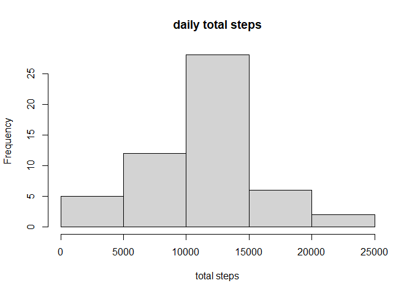
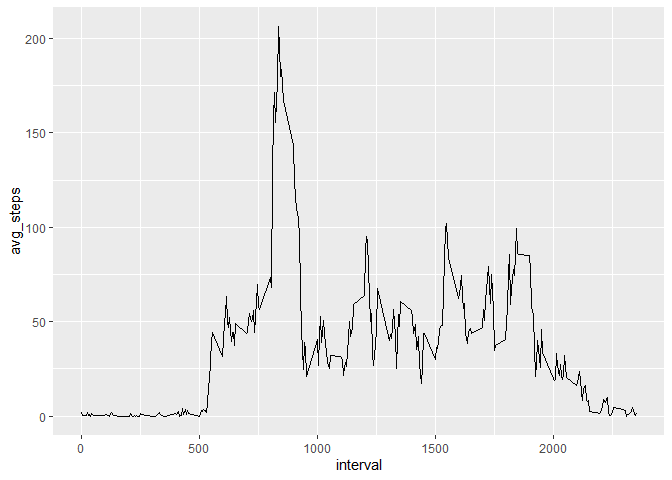
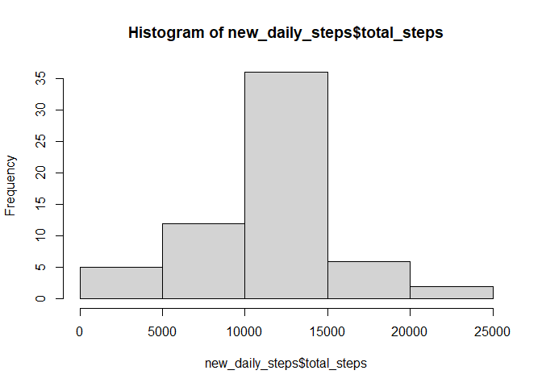
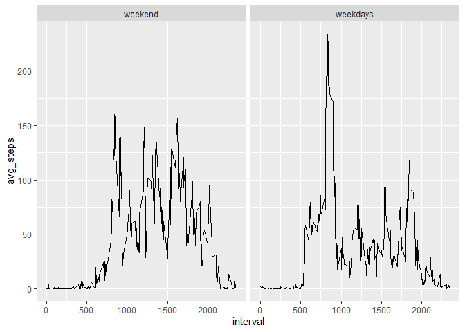

## Loading and preprocessing the data

```r
activity_data=read.csv("activity.csv")
```

## What is mean total number of steps taken per day?


```r
library(dplyr)
```

```
## 
## Attaching package: 'dplyr'
```

```
## The following objects are masked from 'package:stats':
## 
##     filter, lag
```

```
## The following objects are masked from 'package:base':
## 
##     intersect, setdiff, setequal, union
```

```r
library(ggplot2)
#Calculate the total number of steps taken per day
daily_total_steps <- activity_data%>%
                      
                      group_by(date)%>%
                      filter(!is.na(steps))%>%
                      summarize(total_steps=sum(steps))%>%
                      mutate(date=as.Date(date))
#Make a histogram of the total number of steps taken each day
hist(daily_total_steps$total_steps ,main ="daily total steps" , xlab="total steps")
```

<!-- -->

```r
#mean and median of the total number of steps taken per day
avg_total_steps <- mean(daily_total_steps$total_steps)
print(paste("mean total steps: ",avg_total_steps))
```

```
## [1] "mean total steps:  10766.1886792453"
```

```r
median_total_steps <- median(daily_total_steps$total_steps)
print(paste("median total steps: ",median_total_steps))
```

```
## [1] "median total steps:  10765"
```

## What is the average daily activity pattern?

```r
avg_interval_steps <- activity_data %>%
                      filter(!is.na(steps))%>%
                      group_by(interval)%>%
                      mutate(avg_steps=mean(steps))

ggplot(avg_interval_steps, aes(x=interval, y=avg_steps,type='1'))+
  geom_line()
```

<!-- -->

```r
#5-minute interval maximum number of steps
print(max(avg_interval_steps$avg_steps))
```

```
## [1] 206.1698
```

## Imputing missing values

```r
print(sum(is.na(activity_data)))
```

```
## [1] 2304
```

```r
new_data <- activity_data%>%
  mutate(steps=ifelse(is.na(steps), mean(steps, na.rm=T), steps))

new_daily_steps <- new_data%>%
  group_by(date)%>%
  summarize(total_steps=sum(steps))
hist(new_daily_steps$total_steps)
```

<!-- -->

```r
#mean and median of the total number of steps taken per day
avg_total_steps <- mean(new_daily_steps$total_steps)
print(paste("mean total steps: ",avg_total_steps))
```

```
## [1] "mean total steps:  10766.1886792453"
```

```r
median_total_steps <- median(new_daily_steps$total_steps)
print(paste("median total steps: ",median_total_steps))
```

```
## [1] "median total steps:  10766.1886792453"
```


## Are there differences in activity patterns between weekdays and weekends?

```r
weekday <- c('Monday', 'Tuesday', 'Wednesday', 'Thursday', 'Friday')
#two levels – “weekday” and “weekend”
activity_data$daytype <- factor((weekdays(as.Date(activity_data$date)) %in% weekday), labels = c("weekend", "weekdays"))

activity_data_steps <- activity_data%>%
                       group_by(interval, daytype)%>%
                        filter(!is.na(steps))%>%
                        summarize(avg_steps=mean(steps))
```

```
## `summarise()` has grouped output by 'interval'. You can override using the
## `.groups` argument.
```

```r
ggplot(activity_data_steps,aes(x=interval,y=avg_steps ,type="l"))+
  geom_line()+
  facet_wrap(~daytype)
```

<!-- -->
